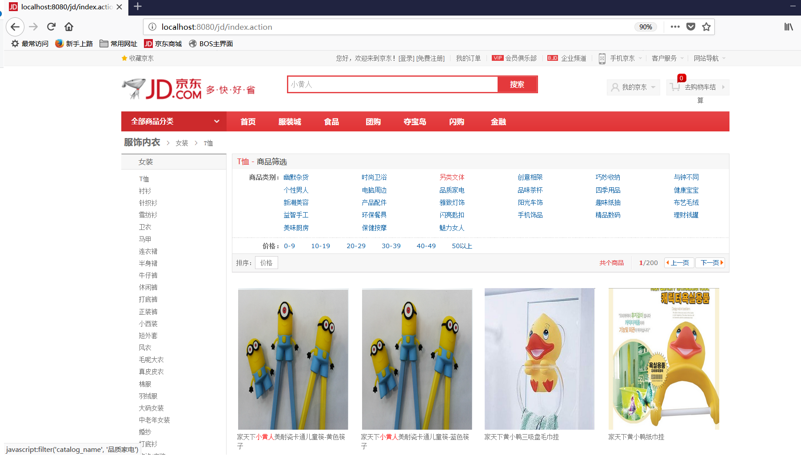

# solrjDemo:sparkling_heart:
模仿网上商城，使用SolrJ进行索引库的查询
---
`material`目录下面存放的是项目所需的数据库脚本和jsp页面等素材。
`web-project`目录下存放的是工程
其中：
- `jd`是web项目的代码
- `solr`是solr工程，放在Tomcat的webapps内
- `solrhome`是索引库，里面存放索引库和与之相关的配置信息。

## 项目效果

## 介绍
- 十分简单只有一个页面
- 首先需要创建索引库，然后通过Solrj查询索引库
- 采用`springmvc`框架获取页面提交数据、视图的转换、和对controller、service、dao层的管理

如果对你有帮助请赏我一颗:sparkling_heart:

